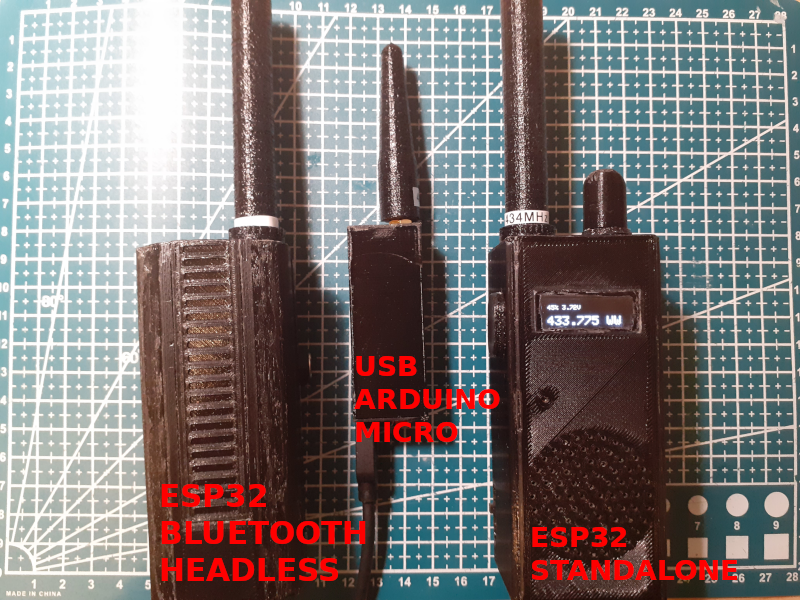

 

# Introduction
**Turn your Android phone into real Amateur Radio HF/VHF/UHF APRS enabled Codec2/OPUS DV (digital voice) and/or FreeDV handheld transceiver.**

**Requires additional hardware (e.g. AFSK/LoRa), software (e.g. Direwolf) radio modem or analog transceiver with USB audio + VOX/USB CAT PTT control, such as MCHF or ICOM**

For more information about FreeDV and Codec2 visit https://github.com/drowe67/codec2

For more information about OPUS codec visit https://opus-codec.org/

For detailed information about project [Wiki](https://github.com/sh123/codec2_talkie/wiki)


# Short Description
What you can do with this app:
- Voice communication:
  - Send and receive Codec2 voice over FreeDV modes
  - Send and receive Codec2/OPUS voice over KISS
  - Send and receive Codec2/OPUS voice encapsulated into APRS UI frames
- Data communication
  - Use APRS over FSK 300 (HF, TX only), AFSK1200 (VHF), FreeDV OFDM (HF) or APRS-IS (Internet)
  - Send and receive APRS position reports
  - Send and receive APRS messages
  - APRS log with raw APRS data
  - APRS station hub with stations grouped by callsign and their log
  - APRS map with ability to see station info, station track with information about each geo position
  - Use application as APRS digirepeater
  - Use application as APRS-IS RX/TX iGate to forward packets to/from APRS-IS (Internet)
  - Use application as APRS-IS internet tracker to send/receive APRS data over Internet
  - Send and receive text packets in lora-aprs format over KISS
- Integrate with hardware/software
  - Use it with your KISS Bluetooth/BLE/USB/TCPIP hardware modem, such as LoRa/FSK/AFSK/etc, control its parameters by using "set hardware" KISS command
  - Use it with KISS software modem using TCPIP, such as Direwolf
  - Use it with your HF/VHF/UHF transceiver as a sound modem
  - Use your phone as a software sound modem by using external USB OTG audio adapter (voice + data) or built-in phone speaker and mic (only data)
  - Use your phone for FreeDV protocol voice communication together with HF transceiver, which supports USB OTG audio
  - Control your external transceiver PTT by using USB serial CAT (or VOX if CAT PTT is not supported)

# Requirements
- Android 7.0 (API 24) or higher
  - Application could also be used with your Android network radio, such as Inrico TM-7, apk just needs to be installed over USB, see [Discussion](https://github.com/sh123/codec2_talkie/issues/4)
- Modem, radio module or transceiver which supports [KISS protocol](https://en.wikipedia.org/wiki/KISS_(TNC)) or can process KISS or raw Codec2 audio frames over serial Bluetooth, BLE, USB or TCP/IP
- Analog transceiver with built-in or external USB audio adapter and VOX or USB CAT PTT control (such as MCHF or iCom IC-7x00 series)

# Dependencies
- Source code is integrated into this project for easier building and customization:
  - Codec2 codec: https://github.com/drowe67/codec2
  - Android Codec2 wrapper code: https://github.com/UstadMobile/Codec2-Android
  - OPUS codec: https://opus-codec.org
- Fetched with gradle as dependency:
  - Android USB serial: https://github.com/mik3y/usb-serial-for-android

# Building
- Building from command line:\
  `ANDROID_HOME=<android dir> JAVA_HOME=<java home dir> ./gradlew <command>`\
  For example:
  ```
  # ANDROID_HOME=~/Android/Sdk JAVA_HOME=~/.jdks/jbr-21.0.4 ./gradlew assembleRelease
  
  Welcome to Gradle 7.0.2!
  
  ... compilation output ...

  > Task :codec2talkie:lintVitalRelease
  No issues found.

  BUILD SUCCESSFUL in 2m 2s
  111 actionable tasks: 40 executed, 71 up-to-date
  ```
- You can also build locally using [act](https://github.com/nektos/act) and [codec2talkie android workflow](https://github.com/sh123/codec2_talkie/blob/master/.github/workflows/android.yml)

# Other similar or related projects
- Hardware
  - ESP32 LoRa APRS modem (used with this application for testing): https://github.com/sh123/esp32_loraprs
  - ESP32 LoRa DV transceiver: https://github.com/sh123/esp32_loradv
  - Arduno Micro KISS modem and APRS AX.25 digirepeater: https://github.com/sh123/micro_loraprs
  - ESP32 Arduino Codec2 library (ESP32 i2s walkie talkie example interoperable with this application): https://github.com/sh123/esp32_codec2_arduino
  - ESP32 Arduino Opus library: https://github.com/sh123/esp32_opus_arduino
  - Minimal Arduino LoRa KISS modem: https://github.com/sh123/lora_arduino_kiss_modem
  - Minimal Arduino NRF24 KISS modem: https://github.com/sh123/nrf24l01_arduino_kiss_modem
- Software:
  - FreeDV TNC: https://github.com/xssfox/freedv-tnc
  - FreeDV data modem UI: https://github.com/DJ2LS/FreeDATA
  - FreeDV official UI: https://github.com/drowe67/freedv-gui
  - Version adopted for M17 protocol usage: https://github.com/mobilinkd/m17-kiss-ht
  - Codec2 iOS wrapper: https://github.com/Beartooth/codec2-ios
- Other interesting projects:
  - LoRa mesh text GPS communicator: https://github.com/meshtastic/Meshtastic-device

# Prototypes used with this application
 - ESP32 LoRa Bluetooth headless APRS modem (no screen and external controls): https://github.com/sh123/esp32_loraprs
 - ESP32 LoRa DV handheld transceiver (with screen and controls): https://github.com/sh123/esp32_loradv
 - Arduno Micro USB KISS modem (no screen and external controls): https://github.com/sh123/micro_loraprs
  


